# Tutorial Pentaho

## 1. Introdução
Este tutorial tem como objetivo demonstrar a utilização do Pentaho Data Integration para realizar a extração, transformação e carregamento de dados (ETL) de forma combinada para uma futura construção de um DataWarehouse. Acompanha também uma série de ferramentas utilizadas para auxiliar na criação de uma melhor análise possível, dado o exemplo das próximas seções.
É importante frisar que os passos abaixo foram realizados no Windows 10.

## 2. Instalação
Primeiro de tudo, vamos à instalação de cada componente que utilizaremos.

#### 2.1. JDK
> O único pré-requisito é ter um runtime Java (máquina virtual java ) instalada ou uma JDK (Kit de Desenvolvimento Java) instalado em sua máquina que pode ser obtida através do [link](https://www.oracle.com/technetwork/pt/java/javase/downloads/jdk8-downloads-2133151.html)
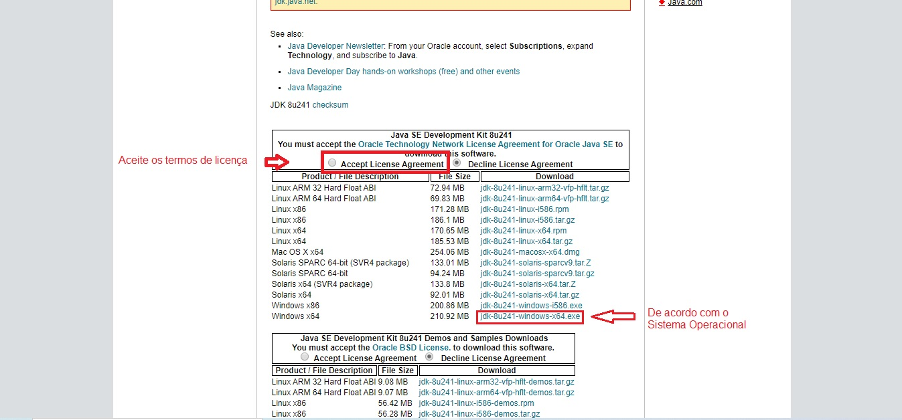

> Após a instalação, podemos seguir as outras instalações...

#### 2.2. Pentaho Data Integration
> Realize o download como indicado na imagem, através do [link indicado](https://sourceforge.net/projects/pentaho/files/Data%20Integration/)
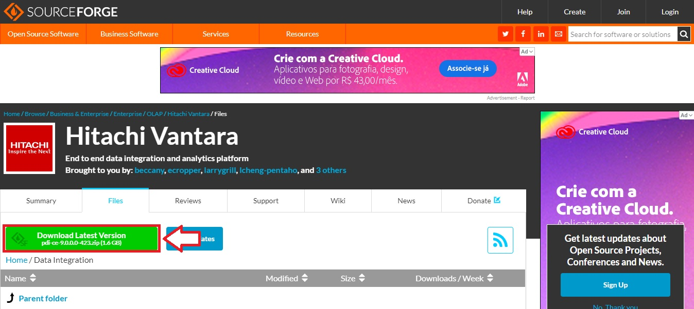

> Ao final do download, a pasta "pdi-ce-8.3.0.0-371" aparecerá no caminho escolhido para armazenar o download. Por padrão, fica em "Downloads".

> Ao entrar na pasta, vá em data-integration

> Para abrir o programa, clique no arquivo Spoon.bat, como indicado na figura abaixo
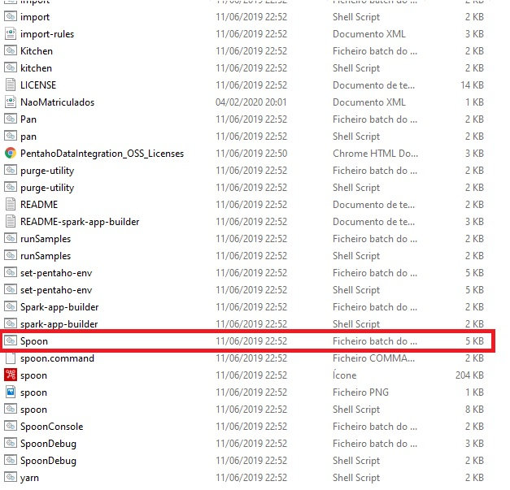

## 3. Onde obter nossas informações
> Bem, temos quase tudo o que precisamos para trabalhar, vamos aos dados que usaremos de exemplo:

> Em [www.dados.gov.br](http://www.dados.gov.br/dataset/microdados-do-censo-da-educacao-superior) podemos extrair alguns dados úteis para uma introdução à ferramenta

> Nele, temos a reunião de  informações sobre as instituições de ensino superior, seus cursos de graduação presencial ou a distância, cursos seqüenciais, vagas oferecidas, inscrições, matrículas, ingressantes e concluintes, além de informações sobre docentes, nas diferentes formas de organização acadêmica e categoria administrativa.
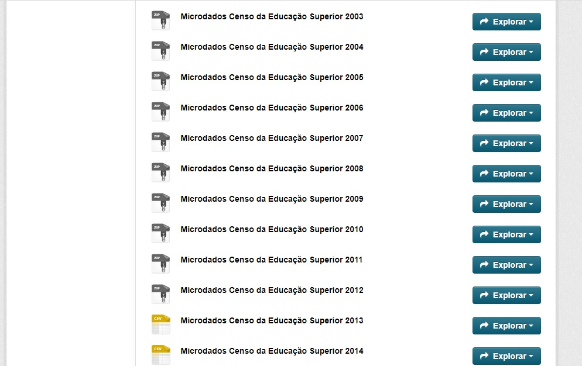

> Cabe destacar nesse ponto a importância de uma ferramenta BI como o Pentaho para ETL: 
- a quantidade de informações geradas são muito grandes, 
- de ambientes diferentes, 
- períodos diferentes e 
- podem ser com padrões diferentes, 
- ou formatos diferentes. 

>Por exemplo, possuímos dados de 1995 a 2014 que podem abordar todas estas questões apresentadas entre si.

>Por se tratar de um tutorial inicial, vamos abordar somente os arquivos .csv

> Portanto, vamos fazer o download do Microdados Censo da Educação Superior 2013 e 2014 para integrar estes dados e gerar o dado final
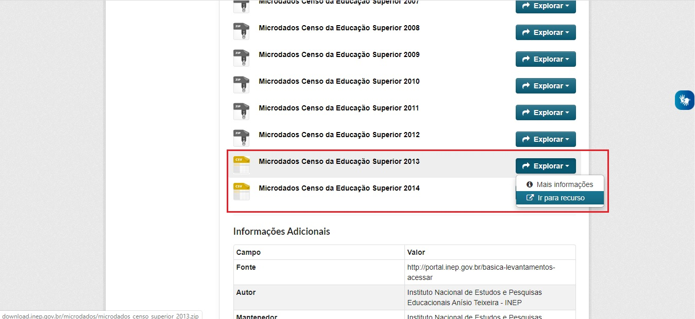

> Ao clicar em "Explorar -> Ir para recurso" o download será realizado automaticamente. Lembre de fazer esse procedimento para os microdados de 2013 e 2014, portanto os passos seguintes deverão ser realizados para os dois:

- Vá ao caminho do download e extraia a pasta microdados_censo_superior_2013
- Entre na pasta e depois "2013\DADOS\DM_CURSO.rar"
- Extraia o arquivo "DM_CURSO.rar"
- Obteremos então o arquivo DM_CURSO.csv que queremos
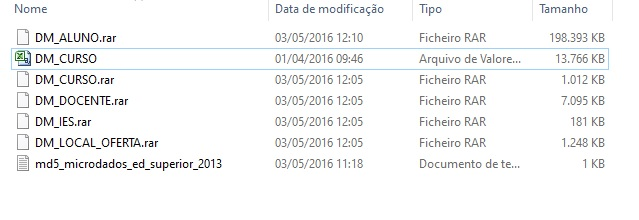

## 4. O exemplo
> Tendo tudo em mãos, hora do nosso exemplo

#### 4.1. Objetivo 

#### 4.2. Iniciando o exemplo

> Para tanto, seguem os passos:
1. Abra o Spoon como demonstrado anteriormente. Esta é sua tela inicial
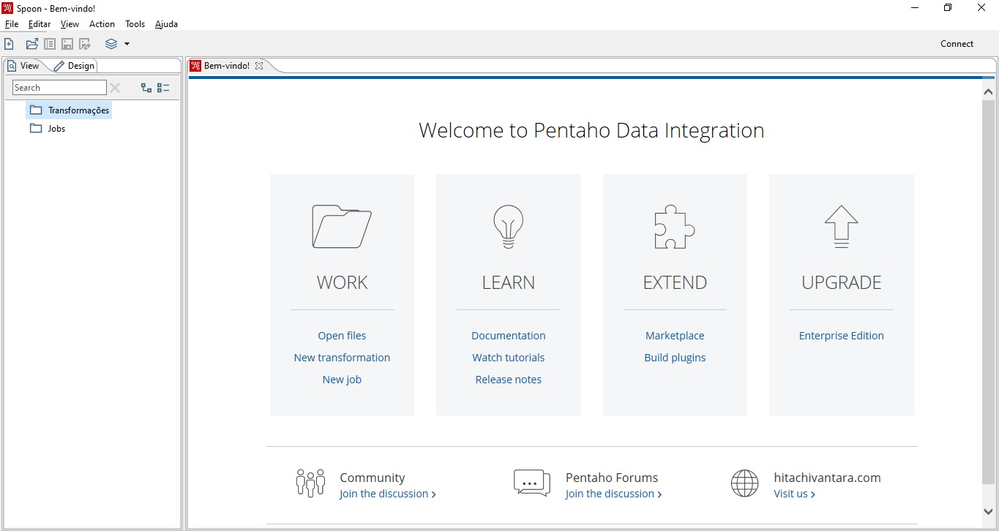
2. Acesse "File->Novo->Transformação" como indicado na imagem
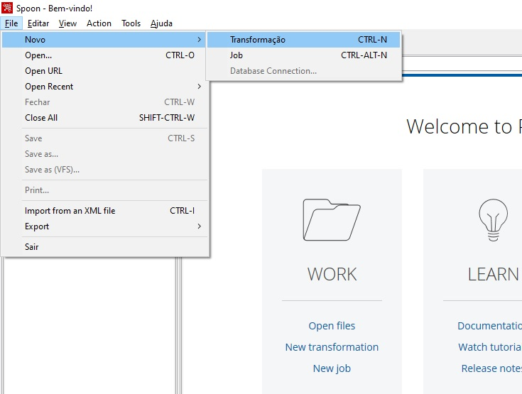

> Uma nova aba se abrirá, este será nosso ambiente de trabalho

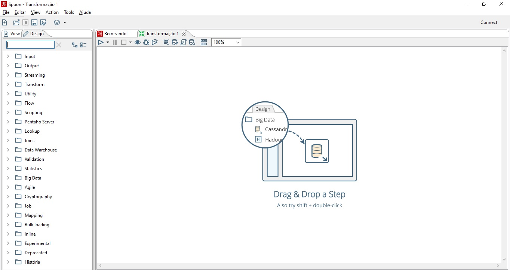

#### 4.3. Importando os dados

1. Expanda a aba input e escolha a opção "CSV file input"
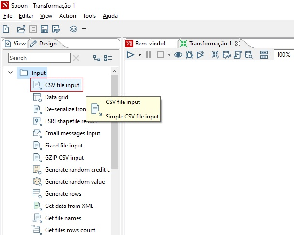

> Com isso, estamos escolhendo um componente (ou step) que será responsável por ler o arquivo CSV baixado anteriormente

2. Arraste a opção para o ambiente de trabalho do Spoon
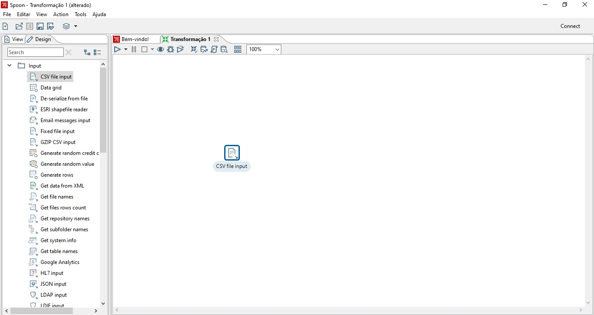
3. Configure o step (clicando duas vezes no componente), conectando-o ao CSV de Microdados Censo da Educação Superior 2013.

> Escolha o nome do componente

> Na opção "Navegar" selecione o local onde está o "DM_CURSO.csv"

> Em "Delimiter", troque de "," para "|"

> Clique em "Obter Campos" para visualizar os campos, caso esteja tudo certo, como na imagem abaixo, clique em "Ok"

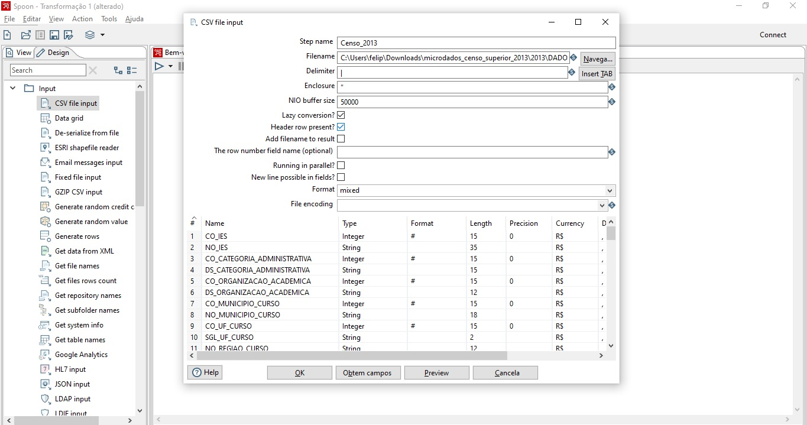

> Pronto, o primeiro step foi criado e configurado.

4. Repita os passos 1, 2 e 3 para os Microdados Censo da Educação Superior 2014

