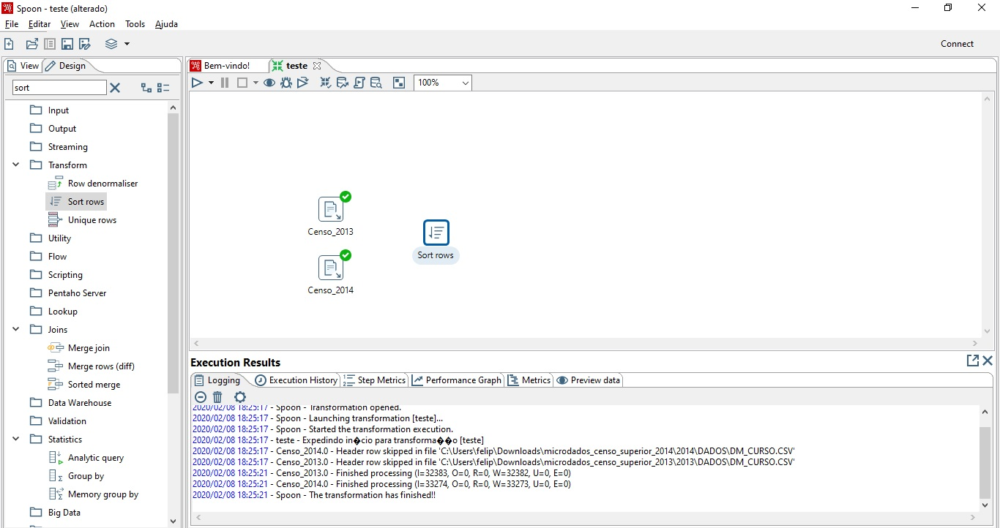

# Tutorial Pentaho

## 1. Introdução
Este tutorial tem como objetivo demonstrar a utilização do Pentaho Data Integration para realizar a extração, transformação e carregamento de dados (ETL) de forma combinada para uma futura construção de um DataWarehouse. Acompanha também uma série de ferramentas utilizadas para auxiliar na criação de uma melhor análise possível, dado o exemplo das próximas seções.
É importante frisar que os passos abaixo foram realizados no Windows 10.

## 2. Instalação
Primeiro de tudo, vamos à instalação de cada componente que utilizaremos.

#### 2.1. JDK
> O único pré-requisito é ter um runtime Java (máquina virtual java ) instalada ou uma JDK (Kit de Desenvolvimento Java) instalado em sua máquina que pode ser obtida através do [link](https://www.oracle.com/technetwork/pt/java/javase/downloads/jdk8-downloads-2133151.html)

> Após a instalação, podemos seguir as outras instalações...

#### 2.2. Pentaho Data Integration
> Realize o download como indicado na imagem, através do [link indicado](https://sourceforge.net/projects/pentaho/files/Data%20Integration/)

> Ao final do download, a pasta "pdi-ce-8.3.0.0-371" aparecerá no caminho escolhido para armazenar o download. Por padrão, fica em "Downloads".

> Ao entrar na pasta, vá em data-integration

> Para abrir o programa, clique no arquivo Spoon.bat, como indicado na figura abaixo

## 3. Onde obter nossas informações
> Bem, temos quase tudo o que precisamos para trabalhar, vamos aos dados que usaremos de exemplo:

> Em [www.dados.gov.br](http://www.dados.gov.br/dataset/microdados-do-censo-da-educacao-superior) podemos extrair alguns dados úteis para uma introdução à ferramenta

> Nele, temos a reunião de  informações sobre as instituições de ensino superior, seus cursos de graduação presencial ou a distância, cursos seqüenciais, vagas oferecidas, inscrições, matrículas, ingressantes e concluintes, além de informações sobre docentes, nas diferentes formas de organização acadêmica e categoria administrativa.

> Cabe destacar nesse ponto a importância de uma ferramenta BI como o Pentaho para ETL: 
- a quantidade de informações geradas são muito grandes, 
- de ambientes diferentes, 
- períodos diferentes e 
- podem ser com padrões diferentes, 
- ou formatos diferentes. 

>Por exemplo, possuímos dados de 1995 a 2014 que podem abordar todas estas questões apresentadas entre si.

>Por se tratar de um tutorial inicial, vamos abordar somente os arquivos .csv

> Portanto, vamos fazer o download do Microdados Censo da Educação Superior 2013 e 2014 para integrar estes dados e gerar o dado final

> Ao clicar em "Explorar -> Ir para recurso" o download será realizado automaticamente. Lembre de fazer esse procedimento para os microdados de 2013 e 2014, portanto os passos seguintes deverão ser realizados para os dois:

- Vá ao caminho do download e extraia a pasta microdados_censo_superior_2013
- Entre na pasta e depois "2013\DADOS\DM_CURSO.rar"
- Extraia o arquivo "DM_CURSO.rar"
- Obteremos então o arquivo DM_CURSO.csv que queremos
- Crie uma pasta chamada "pentaho" e copie o arquivo DM_CURSO.csv para ela

## 4. O exemplo
> Tendo tudo em mãos, hora do nosso exemplo

#### 4.1. Objetivo 

> Nosso objetivo aqui será pegar dados de Censo 2013 e 2014 e compará-los de modo a descobrir se a situação de algum curso mudou de 2013 para 2014. Tal comparação será realizada importando os dados de ambas bases (4.3); ordenando os dados para uma melhor união das tabelas (4.4); selecionando os valores que mais nos interessam, no caso o código no curso, o nome e a situação de um ano para o outro (4.5) e removendo os de menos importância; realizando uma união dos valores obtidos para melhor análise (4.6); filtrando os valores para comparar o ano de 2013 com 2014 (4.7) e, por fim, exportando para um arquivo texto (4.8).

#### 4.2. Iniciando o exemplo

> Para tanto, seguem os passos:
1. Abra o Spoon como demonstrado anteriormente. Esta é sua tela inicial

2. Acesse "File->Novo->Transformação" como indicado na imagem

> Uma nova aba se abrirá, este será nosso ambiente de trabalho

#### 4.3. Importando os dados

1. Expanda a aba input e escolha a opção "CSV file input"

> Com isso, estamos escolhendo um componente (ou step) que será responsável por ler o arquivo CSV baixado anteriormente

2. Arraste a opção para o ambiente de trabalho do Spoon

3. Configure o step (clicando duas vezes no componente), conectando-o ao CSV de Microdados Censo da Educação Superior 2013 (Lembre que está na pasta "pentaho" que criamos anteriormente).

> Escolha o nome do componente

> Na opção "Navegar" selecione o local onde está o "DM_CURSO.csv"

> Em "Delimiter", troque de "," para "|"

> Clique em "Obter Campos" para visualizar os campos, caso esteja tudo certo, como na imagem abaixo, clique em "Ok"

> Pronto, o primeiro step foi criado e configurado.

4. Repita os passos 1, 2 e 3 para os Microdados Censo da Educação Superior 2014

#### 4.4. Organizando da forma que nos interessa

1. Na aba "Transform" pegue o step "Sort rows" e arraste para o ambiente de trabalho, como indicado no step anterior
2. Dê um clique no componente e faça a ligação com o step Censo_2013 como "Main input of Step"

3. Clique duas vezes no step para configurá-lo

4. Refaça os três passos anteriores para os dados de 2014

#### 4.5. Selecionando o que nos interessa

1. Na aba "Transform" pegue o step "Select rows" e arraste para o ambiente de trabalho
2. Dê um clique no componente e faça a ligação com o step Sort_2013 como "Main input of Step"
3. Clique duas vezes no step para configurá-lo

4. Refaça os três passos anteriores para os dados de 2014

> Até o momento temos a seguinte situação:

#### 4.6. Juntando os dados
1. Na aba "Joins" pegue o step "Merge join" e arraste para o ambiente de trabalho
2. Dê um clique no componente e faça a ligação com o step Selecionar_2013 e Selecionar_2014 como "Main input of Step"
3. Clique duas vezes no step para configurá-lo

4. Observe que você deve selecionar os steps passados e clicar em "Get key fields" para obter os campos responsáveis pela junção

#### 4.7. Filtrando os dados
1. Na aba "Flow" pegue o step "Filter rows" e arraste para o ambiente de trabalho
2. Dê um clique no componente e faça a ligação com o step Merge join como "Main input of Step"
3. Clique duas vezes no step para configurá-lo

4. Observe que estamos comparando cada coluna de 2013 com cada coluna de 2014 em busca de encontrar a igualdade entre seus valores e selecionar os que não houveram mudança de um ano para o outro

#### 4.8. Exportando em texto
1. Na aba "Output" pegue o step "Text file output" e arraste para o ambiente de trabalho
2. Dê um clique no componente e faça a ligação com o step Filtrar como "Main input of Step"
3. Clique duas vezes no step para configurá-lo

4. Vamos também criar outro Text file output para os dados restantes, ou seja, os cursos que foram modificados entre 2013 e 2014. Para isso repita o passo 1 a 3.

5. Agora voltamos ao step "Filtrar" e damos dois cliques para configurá-lo novamente

#### 4.9. Esquema final
> Por fim, nosso esquema ficará assim

# 5. Salvando e testando o projeto
1. Em "File" vá para a opção "Save" e salve o arquivo na pasta "pentaho" que criamos anteriormente como "curso_situacao"

2. Ao salvar o projeto, observe o esquema abaixo para algumas explicações

3. Pronto! Ao executar teremos esta visão se tudo estiver correto

4. Nossa pasta "pentaho" ficará assim
<table align="center"><tr><td>
    
</td></tr></table>

5. E nossos arquivos texto ficarão assim

> Observe que diferenca.txt ficou em branco, indicando, portanto que nenhum curso mudou de situação entre o período de 2013 e 2014.

# 6. Para finalizar

> Vimos uma pequena demonstração do poder desta ferramenta e, para melhorar a prática, tente realizar algo parecido com outros dados! Pode ser a mesma ideia, implementado com Censos de outros anos!

> O importante é que por hoje já sabemos como utilizar o Pentaho Data Integration, que é uma entre diversas outras que podem auxiliar no trabalho de ETL. Obrigado por acompanhar até o final, deixe sua opinião e compartilhe com quem mais precise de uma ajudinha ;)
